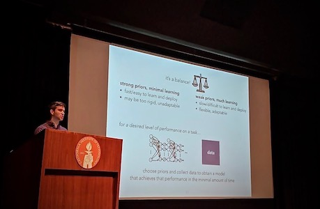

I have been a TA for CNS 187: *Neural Computation* (2015 & 2016) as well as CS 159: *Special Topics in Machine Learning* (2019). I have also given a series of guest lectures in CS 155: *Machine Learning & Data Mining* (2017 - 2019).

### 2015
___

**CNS 187**:  
*Convolutional Neural Networks*  
[slides](../files/lectures/2015/Convolution.pdf)

### 2016
___

**CNS 187**:  
*Convolutional Neural Networks*  
[slides](../files/lectures/2016/deep_learning_cnns.pdf)

*Special Topics: Biological Inspiration*  
[slides](../files/lectures/2016/Special_Topics.pdf)

### 2017
___

**CS 155**:  
*Deep Learning Part I: Neural Networks*  
[slides](../files/lectures/2017/deep_learning_part_1.pdf), video: [1](https://www.youtube.com/watch?v=deAK7a7TB1o) [2](https://www.youtube.com/watch?v=YGRxbXTsMks)

*Deep Learning Part II: CNNs & RNNs*  
[slides](../files/lectures/2017/deep_learning_part_2.pdf), video: [1](https://www.youtube.com/watch?v=k9AYjOXzePM) [2](https://www.youtube.com/watch?v=BEw_9il7qwY)

### 2018
___

**CS 155**:  
*Deep Learning Part I: Neural Networks*  
[slides](../files/lectures/2018/Deep Learning Part I.pdf), [video](https://www.youtube.com/watch?v=tUeWFEZCn7U)

*Deep Learning Part II: CNNs & RNNs*  
[slides](../files/lectures/2018/Deep Learning Part II.pdf), [video](https://www.youtube.com/watch?v=ggcomuj0-8U)

*Deep Learning Part III: Deep Generative Models*  
[slides](../files/lectures/2018/Deep Learning Part III.pdf), [video](https://www.youtube.com/watch?v=hWbnZKXZdEs)

### 2019
___

**CS 155**:  
*Deep Learning Part I: Neural Networks*  
[slides](../files/lectures/2019/Deep Learning Part I 2019.pdf), [video](https://www.youtube.com/watch?v=gdudmI7MwBc)

*Deep Learning Part II: CNNs & RNNs*  
[slides](../files/lectures/2019/Deep Learning Part II 2019.pdf), [video](https://www.youtube.com/watch?v=v_7mZPev9Hk)

*Deep Learning Part III: Deep Generative Models*  
[slides](../files/lectures/2019/Deep Learning Part III 2019.pdf), [video](https://www.youtube.com/watch?v=Sb6RQfG-QQM)

**CS 159**:  
*Introduction to Deep Generative Models*  
[slides](../files/lectures/2019/CS159_lecture1).pdf)

*Maximum Likelihood and Latent Variable Models*  
[slides](../files/lectures/2019/CS159_lecture2.pdf)
